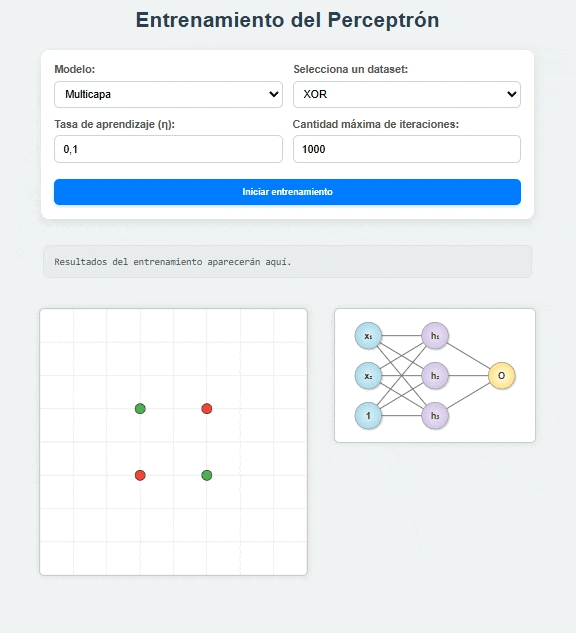

# 🔠 Perceptron Visual

Herramienta interactiva para explorar la **separabilidad lineal** y el comportamiento de redes neuronales simples (**Perceptrón Simple** y **MLP**) directamente en el navegador.

* 🚀 **[Probar Demo en Vivo](https://matias-cisnero.github.io/perceptron-visual-demo/)**
* 📁 **[Repositorio GitHub](https://github.com/matias-cisnero/perceptron-visual)**



## 📁 Estructura del Proyecto

```text
perceptron-visual/
├── index.html     # Estructura y UI
├── style.css      # Estilos y Layout
├── train.js      # Actualización de gráfico
├── utils.js      # Funciones auxiliares para train
└── diagram.js      # Diagramas de modelos
```

## ✨ Créditos

Creado por [Matías Cisnero](https://github.com/matias-cisnero).

## 📌 Licencia

Este proyecto está bajo la licencia MIT.